# BirthBFF Cloud Security & GRC Assessment

**Simulated AWS cloud security assessment for a HIPAA-aligned AI-powered childbirth education platform handling sensitive maternal health data.**

In this project I step into the role of a Cloud Security (GRC) Analyst at BirthBFF, a planned AI-powered childbirth education application that processes sensitive maternal health data. I deploy and intentionally misconfigure an AWS environment to simulate a neglected cloud environment with production-like security risks, then conduct a structured security assessment mapped to HIPAA, NIST SP 800-53 Rev. 5, and CIS AWS Foundations Benchmark v1.4.

The environment includes IAM users with excessive privileges, a publicly accessible S3 bucket containing mock PHI-like patient data, overly permissive security groups, missing network segmentation, and gaps in logging and monitoring coverage. Each misconfiguration is documented as a formal audit finding with framework mappings, evidence screenshots, and remediation guidance.

## Live Report

View the interactive executive security report: [BirthBFF Monthly Security Report](https://birthbff-security-report.vercel.app/)

## Disclaimer

This is a simulated security assessment created for educational and portfolio purposes. No real patient data, production systems, or live healthcare environment were used. All sensitive data shown in screenshots or reports is mock data.

---

## Assessment Scope

| Attribute | Detail |
|---|---|
| Platform | BirthBFF — AI-powered childbirth education application |
| Cloud Provider | AWS (us-east-1) |
| Environment | birthbff-dev |
| Data Classification | Reproductive health data, patient intake, behavioral data |
| Regulatory Scope | HIPAA Security Rule, NIST SP 800-53 Rev. 5, CIS AWS Foundations Benchmark v1.4 |
| Total Findings | 11 (2 Critical, 7 High, 2 Medium) |

---

## Project Outcomes

This assessment produced:

- 11 documented cloud security findings across IAM, storage, networking, compute, and monitoring domains
- A prioritized risk register using likelihood × impact scoring
- Framework mappings to HIPAA Security Rule, NIST SP 800-53 Rev. 5, and CIS AWS Foundations Benchmark v1.4
- Evidence screenshots supporting each finding
- Remediation guidance focused on least privilege, network segmentation, encryption governance, monitoring, and data classification
- An executive-style interactive security report deployed as a static website

---

## Environment Overview

The BirthBFF AWS environment consists of a custom VPC with intentionally misconfigured resources across IAM, networking, storage, compute, and logging layers.

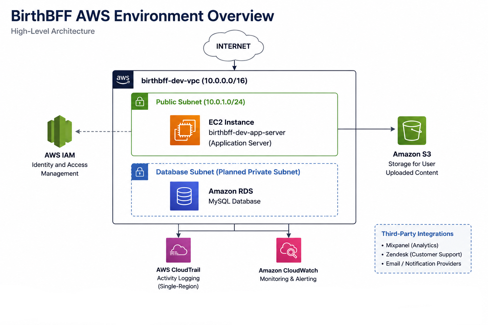

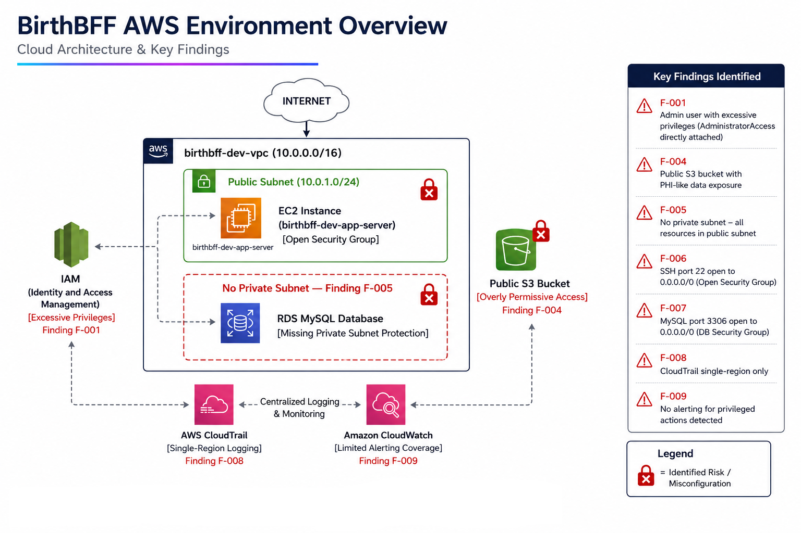

---

## Step 1) IAM Audit

In this phase I reviewed IAM users, attached policies, access key usage, MFA enrollment status, and credential report data for the BirthBFF AWS environment.

**What I found:**

The admin user had AdministratorAccess attached directly to the user account rather than via a role or group, granting unrestricted access to all AWS services. The developer user had S3FullAccess and EC2FullAccess with unused programmatic access keys — a credential exposure risk if keys were exfiltrated. No MFA devices were enrolled for any user and no MFA enforcement policy existed, meaning compromised credentials alone would grant full platform access.

**Findings:** F-001 (Critical), F-002 (High), F-003 (High)

**Evidence:**

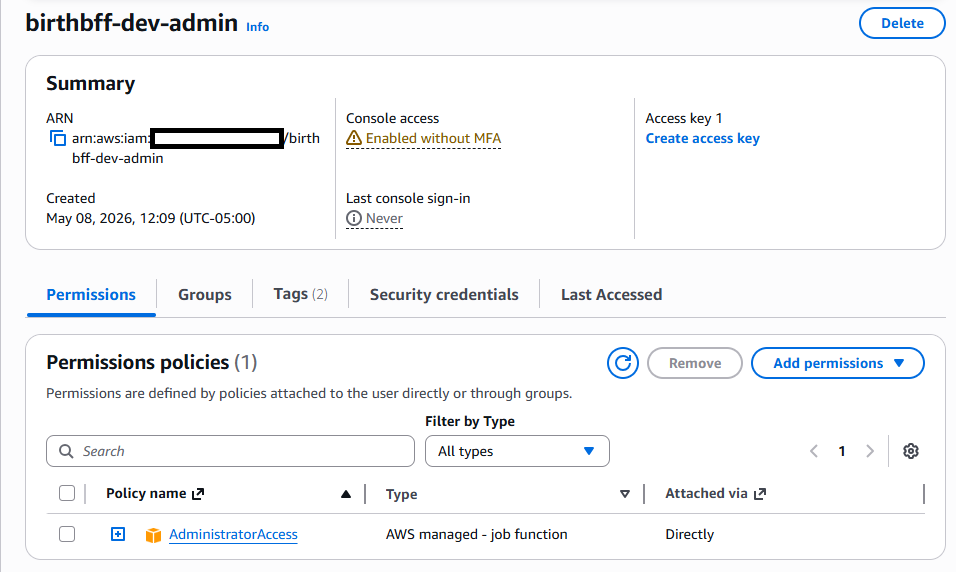

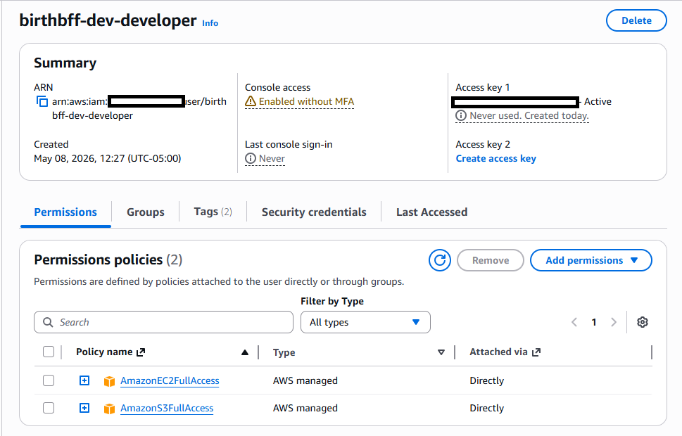

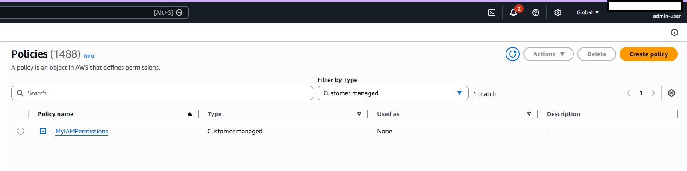

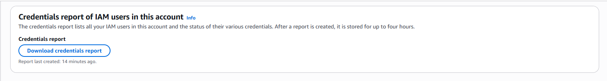

---

## Step 2) Network Security Assessment

In this phase I reviewed the VPC configuration, subnet architecture, security group rules, and network traffic monitoring controls.

**What I found:**

The VPC contained only a public subnet with no private subnet for database or application tier separation. The application server security group permitted inbound SSH from 0.0.0.0/0, exposing the server to brute force and exploitation from any IP on the internet. The database security group was pre-staged with MySQL port 3306 open to 0.0.0.0/0 — any RDS instance deployed with this security group would be immediately internet-accessible. VPC flow logs were not enabled, meaning no network traffic audit trail existed for incident investigation or compliance.

**Findings:** F-005 (High), F-006 (High), F-007 (High), F-011 (High)

**Evidence:**

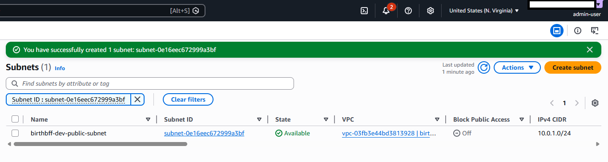

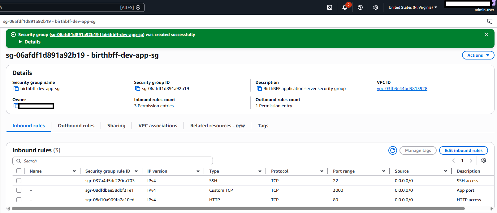

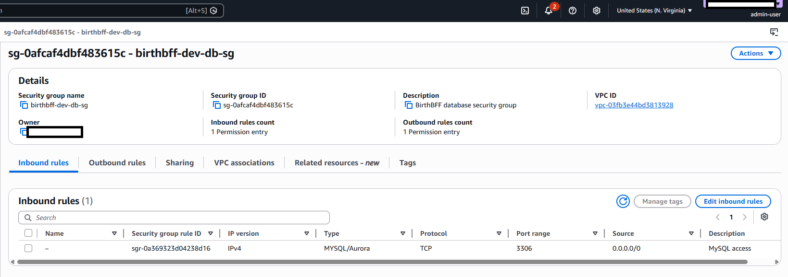

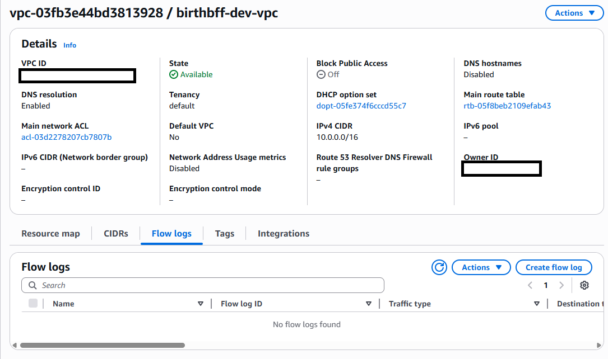

---

## Step 3) S3 Storage Assessment

In this phase I reviewed S3 bucket configuration, access controls, encryption settings, and confirmed the impact of public access misconfigurations against mock PHI-like data.

**What I found:**

The mock patient documents bucket had Block Public Access disabled and a bucket policy granting s3:GetObject to Principal: * — all unauthenticated users. A mock patient intake CSV containing names, dates of birth, due dates, and clinical conditions was confirmed accessible via unauthenticated HTTP request, constituting an unauthorized disclosure of PHI-like data, representing a HIPAA-impacting scenario in a regulated environment. The bucket also used SSE-S3 (AWS-managed keys) rather than a customer-managed KMS key, meaning the organization had no visibility into key access or decrypt operations against patient data.

**Findings:** F-004 (Critical), F-010 (Medium)

**Evidence:**

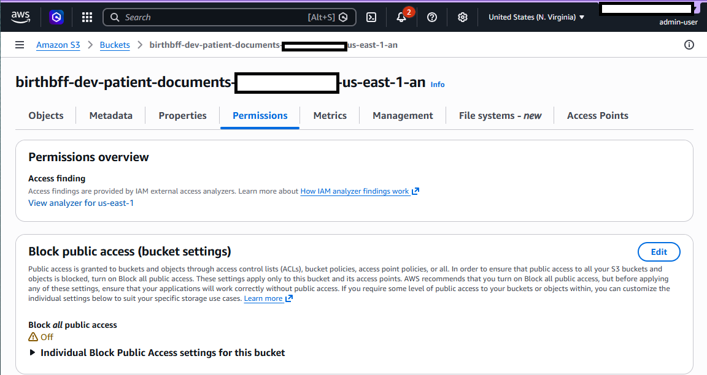

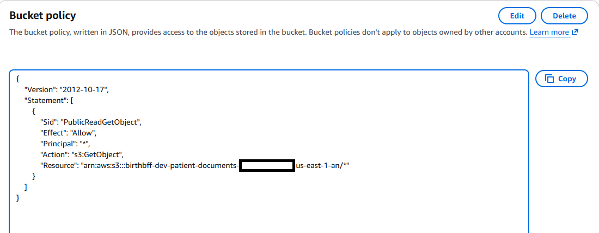

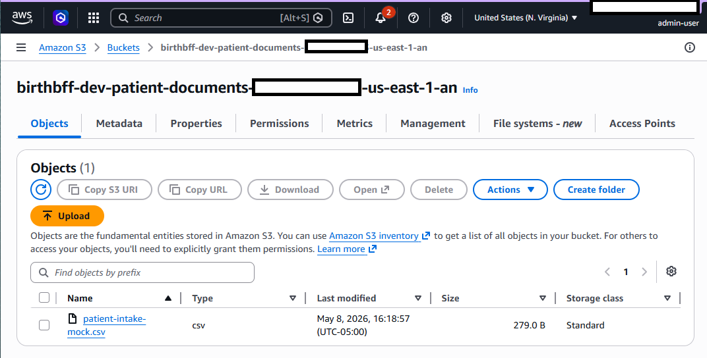

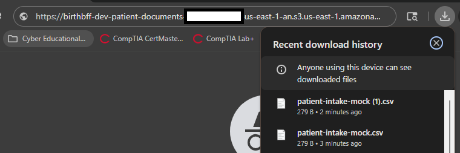

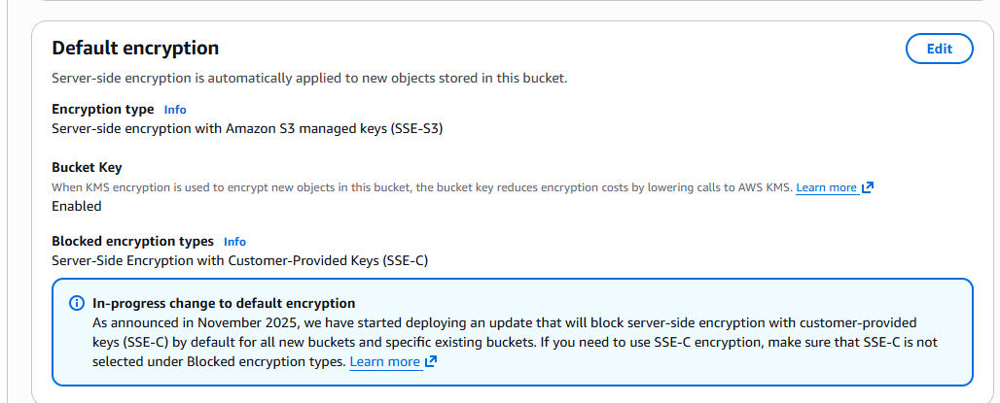

---

## Step 4) EC2 and Compute Assessment

In this phase I reviewed the EC2 instance configuration, attached security groups, IAM instance profile, and network exposure.

**What I found:**

The application server security group permitted unrestricted inbound SSH access from 0.0.0.0/0. Additional application ports were also publicly reachable as part of the simulated deployment. The instance did have an IAM instance profile attached — a compliant control eliminating the need for long-term credentials on the instance. The overly permissive security group rules represented the primary finding for this tier.

**Findings:** F-006 (High — shared with network assessment)

**Evidence:**

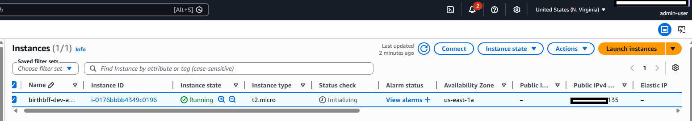

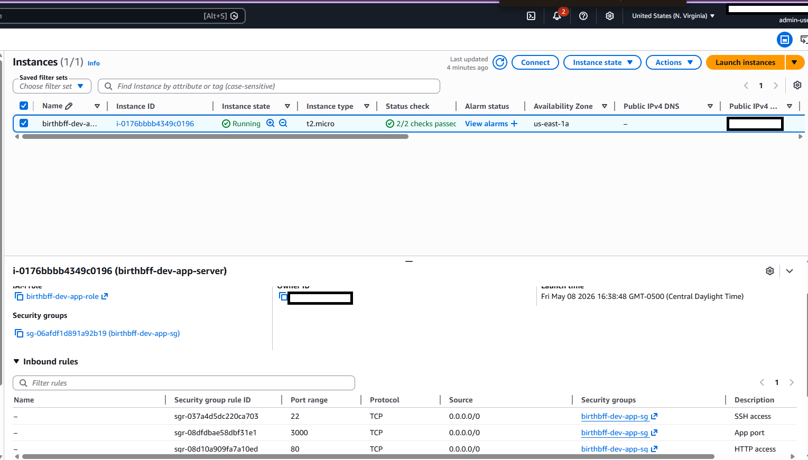

---

## Step 5) Logging and Monitoring Assessment

In this phase I reviewed CloudTrail configuration, log file validation, multi-region coverage, and CloudWatch alerting integration.

**What I found:**

CloudTrail was configured as a multi-region trail capturing management events with log file validation enabled — a compliant baseline. However no CloudWatch Logs integration existed, meaning there were no metric filters or alarms configured for high-risk events including root account usage, IAM policy changes, S3 bucket policy modifications, or console authentication failures. Without alerting, a security incident could occur and remain undetected indefinitely.

**Findings:** F-008 (High)

**Compliant Controls:** Multi-region trail enabled, log file validation enabled

**Evidence:**

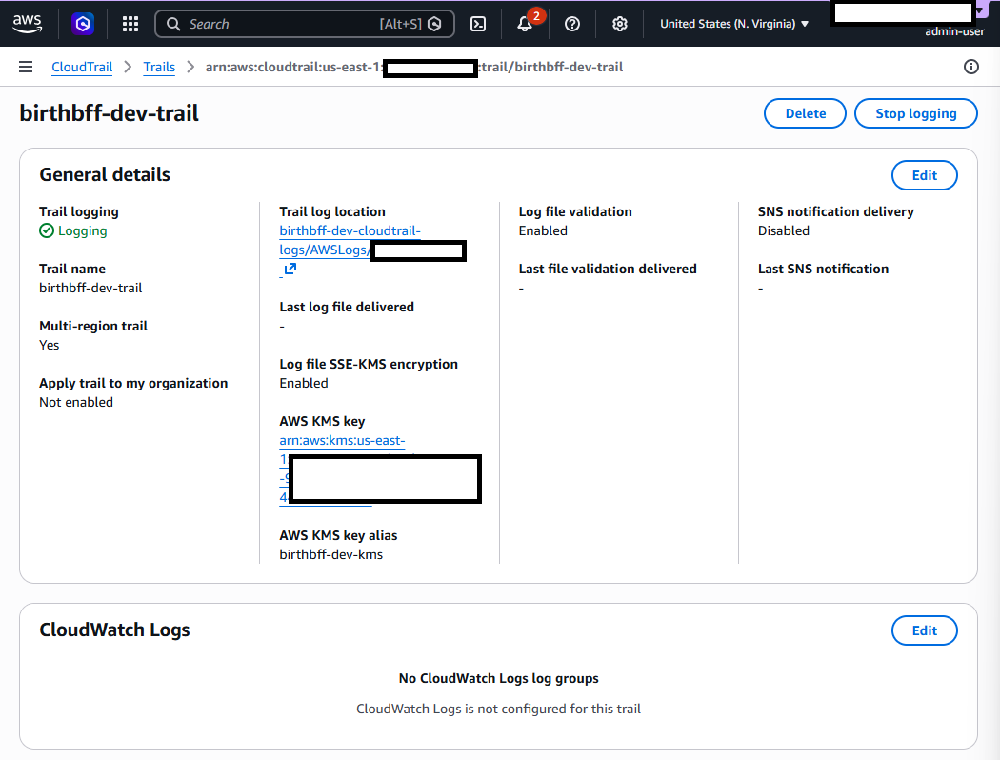

---

## Findings Summary

11 findings were identified across IAM, networking, storage, compute, and logging domains.

| Finding ID | Title | Severity |
|---|---|---|
| F-001 | IAM admin user with AdministratorAccess directly attached | Critical |
| F-002 | Developer user excessive permissions and unused access keys | High |
| F-003 | No MFA enforcement for any IAM user | High |
| F-004 | S3 bucket publicly readable containing PHI-like data | Critical |
| F-005 | No private subnet — all resources in public network tier | High |
| F-006 | EC2 security group allows unrestricted SSH access | High |
| F-007 | Database security group permits unrestricted MySQL access | High |
| F-008 | No CloudWatch alerting for privileged actions | High |
| F-009 | No formal data classification policy | Medium |
| F-010 | S3 bucket uses SSE-S3 instead of SSE-KMS CMK | Medium |
| F-011 | VPC flow logs not enabled | High |

[View Full Findings Report](findings-report.md)

---

## Risk Register

Risks are scored using a 5x5 likelihood and impact matrix. 6 Critical risks were identified requiring immediate remediation, with the publicly accessible S3 bucket containing PHI-like data ranked highest priority. Risk levels may differ from finding severity because risks are scored separately using likelihood × impact based on the threat scenario.

[View Risk Register](risk-register.md)

---

## Tools and Frameworks

| Category | Detail |
|---|---|
| Cloud Platform | AWS (IAM, VPC, S3, EC2, CloudTrail, CloudWatch) |
| Compliance Frameworks | HIPAA Security Rule, NIST SP 800-53 Rev. 5 |
| Benchmark | CIS AWS Foundations Benchmark v1.4 |
| Architecture Diagramming | Draw.io |
| Documentation | Markdown, GitHub |
